# 🔴 PRESIDENT DEVIL

**"A survival horror where combat becomes uncontrollable."**

A top-down roguelike built with [Phaser 3](https://phaser.io/) — explore a procedurally generated presidential compound, fight possessed staff and demonic creatures, and survive chaotic panic events where your weapons evolve but the danger spirals out of control.

  

## Characters

<p align="center">
  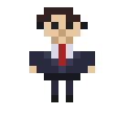
  &nbsp;&nbsp;
  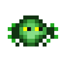
  &nbsp;&nbsp;
  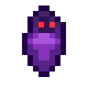
  &nbsp;&nbsp;
  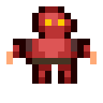
  &nbsp;&nbsp;
  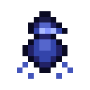
  &nbsp;&nbsp;
  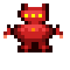
</p>

<p align="center">
  <b>Player</b> &nbsp;·&nbsp; <b>Crawler</b> &nbsp;·&nbsp; <b>Lurker</b> &nbsp;·&nbsp; <b>Brute</b> &nbsp;·&nbsp; <b>Shade</b> &nbsp;·&nbsp; <b>Abomination</b>
</p>

> All sprites are generated at runtime as pixel art — no external assets required.

## Items & Weapons

<p align="center">
  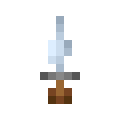
  &nbsp;
  
  &nbsp;
  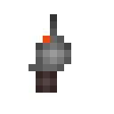
  &nbsp;
  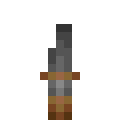
  &nbsp;
  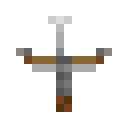
  &nbsp;
  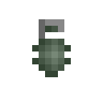
</p>

<p align="center">
  <b>Knife</b> &nbsp;·&nbsp; <b>Bat</b> &nbsp;·&nbsp; <b>Handgun</b> &nbsp;·&nbsp; <b>Shotgun</b> &nbsp;·&nbsp; <b>Crossbow</b> &nbsp;·&nbsp; <b>Grenade</b>
</p>

<p align="center">
  
  &nbsp;
  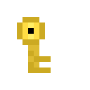
  &nbsp;
  
  &nbsp;
  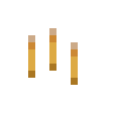
  &nbsp;
  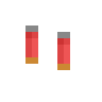
  &nbsp;
  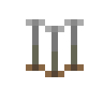
</p>

<p align="center">
  <b>Health</b> &nbsp;·&nbsp; <b>Key</b> &nbsp;·&nbsp; <b>Repair Kit</b> &nbsp;·&nbsp; <b>Ammo (Pistol)</b> &nbsp;·&nbsp; <b>Ammo (Shotgun)</b> &nbsp;·&nbsp; <b>Ammo (Crossbow)</b>
</p>

## Dungeon Tiles

<p align="center">
  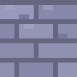
  &nbsp;
  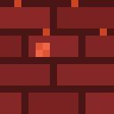
  &nbsp;
  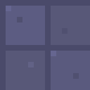
  &nbsp;
  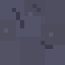
  &nbsp;
  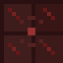
</p>

<p align="center">
  <b>Wall</b> &nbsp;·&nbsp; <b>Ritual Wall</b> &nbsp;·&nbsp; <b>Office Floor</b> &nbsp;·&nbsp; <b>Corridor</b> &nbsp;·&nbsp; <b>Boss Floor</b>
</p>

<p align="center">
  
  &nbsp;
  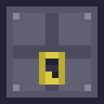
  &nbsp;
  
</p>

<p align="center">
  <b>Door</b> &nbsp;·&nbsp; <b>Locked</b> &nbsp;·&nbsp; <b>Sealed</b>
</p>

## Story

The President of the country is, in fact, the Devil. You play as his personal assistant — a woman who discovers the horrifying truth and must survive the chaos unfolding inside the presidential compound. She's resourceful, not a soldier, improvising with whatever she can find.

## Play

**[▶ Play Now in your browser](https://rpgmira.github.io/PresidentDevil/)**

Or run locally — no install required:

```bash
npx -y http-server -p 8080 -c-1
```

Then visit **http://localhost:8080**

## Controls

| Key | Action |
|-----|--------|
| **WASD** / Arrow Keys | Move |
| **Mouse** | Aim |
| **Click** | Fire ranged weapon |
| **0** | Equip fists (default melee) |
| **1–6** | Select inventory slot |
| **Q** | Drop selected item |

## Features

### Core Loop: Tension → Chaos → Relief → Vulnerability

- **Explore** — Dark, procedural rooms with fog of war and limited visibility
- **Trigger** — Corruption builds from combat and noise, triggering panic events
- **Panic** — Doors seal, enemies flood in waves, weapons temporarily evolve
- **Aftermath** — Power fades, loot drops, but the world is now more dangerous

### Implemented (Phase 1)

- 🗺️ **Procedural Dungeon** — Rooms, corridors, doors (normal, locked, sealed)
- ⚔️ **Dual-Wield Combat** — Auto-melee + manual ranged, running simultaneously
- 🔫 **Weapons** — Fists, knife, bat, chainsaw, handgun, shotgun, crossbow, grenades
- 🔧 **Durability & Repair** — Melee weapons break with use, repair kits restore them
- 👹 **Enemies** — Crawlers (fast, weak) and Lurkers (slow, strong) with patrol/chase/investigate AI
- 🔊 **Noise System** — Loud weapons attract nearby enemies
- 🌀 **Corruption** — Builds from combat, increases difficulty, triggers panic events
- ⚡ **Weapon Evolutions** — Random power-ups during panic (Frenzy, Slam, Spread Shot, Piercing, Berserker)
- 🎒 **Inventory** — 6 slots for weapons, ammo, keys, repair kits. Drop items with Q
- 🗝️ **Locked Doors** — Find keys to access new areas
- 🌑 **Fog of War** — Explored areas stay dimly visible, entities fade in darkness
- 📊 **HUD** — Health, corruption meter, minimap, inventory bar, weapon info
- 🏆 **Win Condition** — Reach the boss room to escape
- 💀 **Permadeath** — Death ends the run with full stats

### Design Principle

> **Power creates danger, not safety.**
>
> Fighting increases corruption. Higher corruption = stronger enemies, more frequent hordes. Strong builds spawn stronger enemies. Avoiding fights can be safer — but riskier in other ways.

## Tech Stack

| Layer | Technology |
|-------|------------|
| Engine | Phaser 3.80.1 (CDN) |
| Client | Vanilla HTML + JavaScript |
| Server | Static file server (any) |

## Project Structure

```
├── index.html              # Entry point
├── js/
│   ├── main.js             # Phaser game config
│   ├── constants.js        # All game configuration
│   ├── spriteGenerator.js   # Player pixel-art sprites
│   ├── enemySpriteGenerator.js  # Enemy pixel-art sprites
│   ├── itemSpriteGenerator.js   # Item pixel-art sprites
│   ├── tileSpriteGenerator.js   # Wall/floor/door pixel-art tiles
│   ├── dungeon.js          # Procedural generation
│   ├── player.js           # Player controller & inventory
│   ├── enemies.js          # Enemy AI & spawning
│   ├── combat.js           # Melee, ranged, projectiles
│   ├── corruption.js       # Corruption/noise system
│   └── scenes/
│       ├── TitleScene.js    # Title screen
│       ├── GameScene.js     # Main gameplay
│       ├── HUDScene.js      # Overlay HUD (zoom-independent)
│       ├── DeathScene.js    # Death screen with stats
│       └── VictoryScene.js  # Victory screen
├── sprites/                # Character PNGs for README
├── PLAN.md                 # Full development roadmap
└── REFERENCE.png           # Concept art reference
```

## Roadmap

- **Phase 1** ✅ Playable prototype (single player)
- **Phase 2** 🔲 Polish & content (audio, sprites, particle effects, enemy variety)
- **Phase 3** 🔲 Multiplayer (WebSocket co-op/competitive)
- **Phase 4** 🔲 Expansion (bosses, biomes, story, daily challenges)

See [PLAN.md](PLAN.md) for the full roadmap with detailed tasks.

## License

MIT
